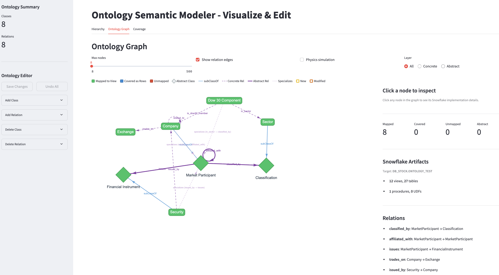

<p align="center">
  
</p>

# ontology-stack-builder

A [Cortex Code](https://docs.snowflake.com/en/user-guide/cortex-code/cortex-code) skill that generates the full **Ontology-on-Snowflake** stack from any relational schema through a 7-phase gated workflow.

You bring your Snowflake tables and business questions. The skill builds the rest — metadata, abstract views, semantic models, and a Cortex Agent — in a single conversational session.

For the architectural foundations, see the original blog series:
- [Part 1 — Overview and Data Model](https://medium.com/snowflake/ontology-on-snowflake-part-1-overview-and-data-model-9e8eeaac7363)
- [Part 2 — Semantic Models](https://medium.com/snowflake/ontology-on-snowflake-part-2-semantic-models-9aa0fa9b9312)
- [Part 3 — AI-Powered Intelligence](https://medium.com/snowflake/ontology-on-snowflake-part-3-ai-powered-intelligence-bbace87c6be1)

---

## What It Builds

| Layer | What Gets Created |
|-------|-------------------|
| **L1 — Physical Storage** | Source table views or KG_NODE/KG_EDGE graph tables |
| **L2 — Ontology Metadata** | ~22 metadata tables with auto-populated seed data |
| **L3 — Abstract Views** | Per-class abstract views, hierarchy views, view-generator procedure |
| **L4 — Semantic Views** | Base semantic view (reused from existing or created over source tables) + ontology-layer semantic views |
| **L5 — Cortex Agent** | Agent with intent-routed tools: base + ontology + optional graph UDFs |

---

## Installation

```bash
# User-level (all projects)
git clone https://github.com/sfc-gh-tjia/coco_skill_ontology_stack_builder.git
cp -r coco_skill_ontology_stack_builder ~/.snowflake/cortex/skills/ontology-stack-builder

# Or project-level (single project)
cp -r coco_skill_ontology_stack_builder .cortex/skills/ontology-stack-builder
```

### Prerequisites

- **Cortex Code** CLI
- **Snowflake account** with CREATE TABLE, CREATE VIEW, CREATE PROCEDURE permissions
- **Python 3.10+** (dependencies managed automatically via `uv`)

---

## Usage

A single prompt kicks off the workflow:

```
Use ontology-stack-builder skill. Build an ontology stack on MY_DB.MY_SCHEMA using these inputs:

Database: MY_DB, Schema: MY_SCHEMA
Source tables: TABLE_A, TABLE_B, TABLE_C
Ontology name: MY_ONTOLOGY
Path: Direct table path
Business questions: What products does each customer buy? How are customers segmented?
Semantic views: Ontology + Metadata
```

### Prompt Fields

| Field | Description |
|-------|-------------|
| **Database / Schema** | Snowflake location for all generated objects |
| **Source tables** | Existing tables to introspect for ontology design |
| **Ontology name** | Prefix for all generated objects (e.g., `STOCK`) |
| **Path** | *Knowledge Graph* — universal KG_NODE/KG_EDGE tables with graph analytics; duplicates data. *Direct Table* — views over existing tables; no data movement |
| **Business questions** | Natural-language questions that guide semantic model creation |
| **Semantic views** | Which ontology-layer models to create on top of the base: *Ontology* (abstract reasoning), *Metadata* (governance/discovery), *KG* (concrete graph queries, KG path only). A base semantic view over the source tables is always present — reused from existing or created in Phase 4.5 |

All fields are optional — the skill will ask for anything you omit.

---

## The 7-Phase Workflow

Every phase ends with a mandatory gate — the skill stops and asks for your approval before continuing.

### Phase 1 — Gather Inputs
Collects and validates database, schema, tables, business questions, path choice, and ontology name. Discovers existing semantic views in the target schema and asks whether to reuse one as the base or create from scratch. Presents a structured summary for confirmation.

### Phase 2 — Analyze & Recommend Ontology
Introspects source tables (or parses an OWL file) and proposes classes, relations, and a class hierarchy. If an existing semantic view was found in Phase 1, its curated metadata (column descriptions, relationships, metrics) enriches the proposals. You review and adjust before proceeding.

### Phase 3 — Visualize, Modify & Confirm
Launches an interactive Streamlit visualizer with three tabs — Hierarchy (expandable trees), Ontology Graph (interactive node-edge diagram), and Coverage (design structure). A sidebar editor lets you add, remove, or modify classes and relations visually.

### Phase 4 — Generate & Deploy
Generates SQL for all Layer 1-3 artifacts, runs a completeness check, and deploys to Snowflake. After deployment, generates a coverage manifest and re-launches the visualizer with four coverage states: green (mapped), blue (covered by ancestor), red (unmapped), gray (abstract).

### Phase 4.5 — Ensure Base Semantic View
If you have an existing semantic view over your source tables, the skill reuses it. Otherwise, it delegates to the native `semantic-view` skill to create a base semantic view covering your source tables directly. This ensures the final agent always has a tool for concrete data queries.

### Phase 5 — Ontology Semantic Views
Delegates to the native `semantic-view` skill to create ontology-layer models (KG, Ontology, Metadata) over the objects deployed in Phase 4. Tests each model against the business questions from Phase 1.

### Phase 6 — Cortex Agent
Delegates to the native `cortex-agent` skill to create the orchestration layer with intent-routed tools — base semantic (Phase 4.5) + ontology-layer semantics (Phase 5) + optional graph tools.

### Phase 7 — End-to-End Validation
Validates the full stack: row counts, sample queries, semantic view checks, and an end-to-end agent test.

---

## Starting Points

The skill adapts to what you already have:

### By Ontology Source

| Path | When to Use |
|------|-------------|
| **Schema-First Discovery** | You have Snowflake tables but no ontology. The skill analyzes your schema and proposes one. |
| **OWL Import** | You have a formal ontology (OWL, RDF, Turtle, N-Triples, N3). The skill parses it and maps to your tables. |
| **Hybrid** | Start with schema discovery, export, refine externally, re-import. |

### By Existing Semantics

| Scenario | What Happens |
|----------|-------------|
| **Have existing semantic view** | The skill discovers it in Phase 1, reuses it as the base semantic tool, and skips Phase 4.5. Existing metadata (column descriptions, relationships, metrics) enriches the ontology proposals in Phase 2. |
| **Tables only (no semantic)** | The skill creates a base semantic view in Phase 4.5 via the `semantic-view` skill before building ontology-layer semantics. |

Both scenarios also support KG path or direct-table path — the 2x2 combination (KG/Direct x Has Semantic/No Semantic) is fully handled.

### End-State Asset Matrix

The table below shows what gets created for each combination of starting point. Rows are grouped by layer; columns represent the four primary paths. Optional KG-only features are shown separately.

**Core paths (always created):**

| Layer | Artifact | KG + No Semantic | KG + Existing Semantic | Direct + No Semantic | Direct + Existing Semantic |
|-------|----------|:---:|:---:|:---:|:---:|
| **L1** | KG_NODE, KG_EDGE tables | Y | Y | — | — |
| **L1** | V_{CLASS} entity views | Y (from KG_NODE) | Y (from KG_NODE) | Y (over source tables) | Y (over source tables) |
| **L1** | V_{REL} relationship views | Y (from KG_EDGE) | Y (from KG_EDGE) | Y (over source tables) | Y (over source tables) |
| **L2** | ~22 ONT_* metadata tables + seed data | Y | Y | Y | Y |
| **L3** | VW_ONT_{CLASS} abstract views | Y | Y | Y | Y |
| **L3** | VW_ONT_ALL_ENTITIES, hierarchy views | Y | Y | Y | Y |
| **L3** | SP_GENERATE_ONTOLOGY_VIEWS | Y | Y | Y | Y |
| **L4** | Base semantic view (source tables) | Created in Phase 4.5 | Reused from existing | Created in Phase 4.5 | Reused from existing |
| **L4** | Ontology semantic view (VW_ONT_*) | If selected | If selected | If selected | If selected |
| **L4** | Metadata semantic view (ONT_*) | If selected | If selected | If selected | If selected |
| **L4** | KG semantic view (V_* views) | If selected | If selected | — | — |
| **L5** | Cortex Agent | Y | Y | Y | Y |

**Optional features (KG path only):**

| Layer | Artifact | Description |
|-------|----------|-------------|
| **L2** | REL_EDGE_INFERRED, ONT_CONSTRAINT_VIOLATION | Created if inference engine selected |
| **L2** | SP_INFER_TRANSITIVE, SP_INFER_INVERSE, SP_RUN_ONTOLOGY_INFERENCE | Created if inference engine selected |
| **L2** | SP_CHECK_CARDINALITY_SINGLE, SP_CHECK_REFERENTIAL | Created if inference engine selected |
| **L5** | EXPAND_DESCENDANTS_TOOL, GET_ANCESTORS_TOOL | Created if graph traversal UDFs selected |
| **L5** | GET_HIERARCHY_PATH_TOOL, GET_DIRECT_CHILDREN_TOOL | Created if graph traversal UDFs selected |
| **L5** | SPCS graph service + 3 service functions | Created if SPCS graph analytics selected |

**Key differences by path:**
- **KG path** creates physical graph tables (KG_NODE/KG_EDGE) and loads data into them. Concrete views extract typed projections from PROPS. Unlocks inference engine, graph UDFs, SPCS, and KG semantic view.
- **Direct table path** creates no physical tables. Concrete views are thin wrappers over existing source tables. Lighter weight, no data duplication, but no graph analytics.
- **Existing semantic** skips Phase 4.5 entirely and enriches Phase 2 ontology proposals with curated metadata from the existing model.
- **No semantic** creates a new base semantic view in Phase 4.5 via the `semantic-view` skill.

---

## Optional Features

Not every domain needs every feature. The skill surfaces these as explicit choices during the workflow:

| Feature | When Offered | What It Does |
|---------|-------------|-------------|
| **Inference Engine** | Phase 4 (KG path) | Stored procedures for transitive closure, inverse relationship materialization, and cardinality/referential constraint checking |
| **Graph Traversal UDFs** | Phase 4 (KG path) | 4 SQL table functions (expand descendants, get ancestors, find hierarchy path, list direct children) — pure SQL, no infrastructure |
| **SPCS Graph Analytics** | Phase 6 (KG path) | Containerized NetworkX service for centrality, community detection, and shortest path via Snowpark Container Services |

---

## Project Structure

```
ontology-stack-builder/
├── SKILL.md                        # Skill definition (the 7-phase workflow)
├── pyproject.toml                  # Python dependencies
├── README.md
├── assets/
│   └── ontology-graph.png          # Header image
├── scripts/
│   ├── introspect_schema.py        # Schema-first ontology discovery
│   ├── parse_owl.py                # OWL/RDF parser (OWL, RDF, Turtle, N-Triples, N3)
│   ├── generate_ontology_sql.py    # SQL generator for Layers 1-3
│   ├── generate_spcs_scaffolding.py # SPCS graph service scaffolding (optional)
│   └── visualize_ontology.py       # Streamlit visualizer with editor and coverage mapping
├── references/
│   ├── physical_layer_template.sql   # KG_NODE/KG_EDGE DDL template
│   ├── metadata_tables_template.sql  # ONT_* table DDL template
│   ├── abstract_views_template.sql   # VW_ONT_* view patterns
│   ├── semantic_model_template.yaml  # Cortex Analyst YAML pattern
│   └── agent_config_template.json    # Cortex Agent config pattern
└── specs/
    └── features/ontology-stack-builder/
        ├── requirements.md         # REQ-001 through REQ-015
        ├── design.md               # Architecture, data flow, script details
        └── tasks.md                # Implementation task tracking
```

Semantic views (L4) and the Cortex Agent (L5) are created by native bundled skills (`semantic-view`, `cortex-agent`), not scripts.
